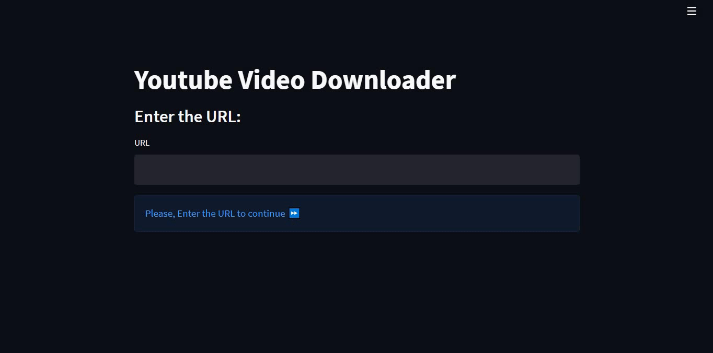

## Youtube Video Downloader App


- `pytube` is a lightweight, Pythonic, dependency-free, library (and command-line utility) for downloading YouTube Videos.
- Youtube video downloader app gets the URL from the User using streamlit's `text_input`.
- If the URL is empty then app will displays a info message `Please, Enter the URL to continue`.
- If the URL is Invalid then app will displays a warning message `Invalid URL`.
- If the URL is valid then app will displays a resolution list and `process` button to continue.
- After user selected a resolution and clicked the `process` button it will download the file and store it in a temporary location.
- Finally When the user click the `download` button the file is downloaded to their local machine.

### Installation
To install all necessary requirement packages for the app 👇
```
pip install -r requirements.txt
```

simple function to validate if the given URL is valid or not
```python
from pytube import YouTube
from pytube.exceptions import RegexMatchError, VideoUnavailable
def validate_url(url):  # Check to ensure that the url is valid or not
    try:
        return YouTube(url)
    except RegexMatchError:
        st.error('Invalid URL.')
    except VideoUnavailable:
        st.error('This video is unavailable')
```
If you like this work hit a star to my github repository and fork this repository.

### If the URL is invalid


### If the URL is empty


### If the URL is valid

